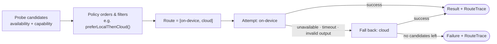

# Policy

An `InferencePolicy` orders the available providers into a route. The engine probes
candidates (availability + capability), the policy filters and orders them, and the
engine executes with fallback. Five built-in presets cover the common cases:

```kotlin
Policies.localOnly()                  // on-device only
Policies.cloudOnly()                  // cloud/remote only
Policies.preferLocalThenCloud()       // local first, fall back to cloud
Policies.preferCloudThenLocal()       // cloud first, fall back to local
Policies.validateLocalThenCloudRepair() // local, then cloud repair on validation failure
```

Set a default on the store (`policy = …`) or override per request
(`InferenceRequest.policy`).



Each fallback hop and every rejected provider is recorded in the
[route trace](../technical/event-model.md), so you can always see *why* a request landed
where it did.

A policy **cannot** bypass the privacy gate — privacy enforcement is a separate,
mandatory step that runs before any provider work, so a policy can never route to a
provider the request's `PrivacyPolicy` forbids.

Learn more: [routing policy spec](../technical/routing-policy.md),
[Security & privacy](../guides/security-and-privacy.md).
