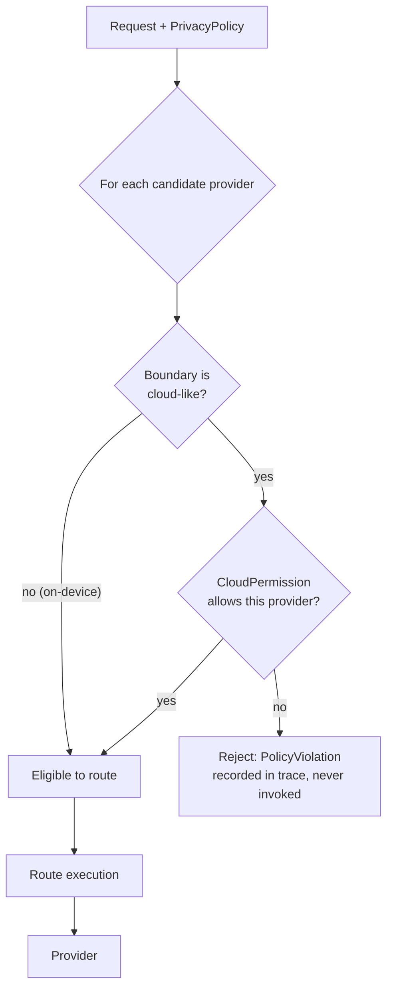

# Privacy model source of truth

Updated: 2026-06-13

This document is the source of truth for InferenceStore privacy semantics. Other documents may summarize this model, but they should not introduce new privacy classes, defaults, or persistence rules.

## Design principle

Privacy is enforced by the execution controller before any provider invocation. Routing policy can choose candidates, but it cannot override a privacy denial. Provider adapters are not trusted to self-enforce privacy.



The gate is independent of the routing-policy DSL: even a buggy or adversarial policy
cannot route to a provider the `PrivacyPolicy` forbids, because denial happens before
the route is executed.

## Canonical request field

Every `InferenceRequest` carries a `PrivacyPolicy`.

```kotlin
data class PrivacyPolicy(
    val classification: PrivacyClass,
    val cloud: CloudPermission,
    val persistence: PersistencePermission,
    val telemetry: TelemetryPermission,
    val redaction: RedactionPolicy = RedactionPolicy.Default,
    val providerBoundary: ProviderBoundaryRequirement = ProviderBoundaryRequirement.Default
)
```

`PrivacyPolicy.Default` is strict: `Personal` data, cloud denied, no prompt/output persistence, metadata-only telemetry. Quickstarts may use `PrivacyPolicy.publicData()` for harmless demo prompts, but production examples should make privacy explicit.

## Canonical privacy classes

There are five built-in classes plus an extension form.

```kotlin
sealed interface PrivacyClass {
    data object Public : PrivacyClass
    data object Internal : PrivacyClass
    data object Personal : PrivacyClass
    data object Sensitive : PrivacyClass
    data object LocalOnly : PrivacyClass
    data class Custom(val value: String) : PrivacyClass
}
```

### Class meanings

| Class | Meaning | Default cloud behavior | Default persistence | Default telemetry |
|---|---|---|---|---|
| `Public` | Content intentionally public or non-sensitive demo content. | Allowed. | Prompt/output may persist only when cache policy also opts in. | Metadata, hashes, provider/model IDs, metrics. |
| `Internal` | Non-personal app, org, or product data that is not public. | Approved cloud providers only. | No prompt persistence; output persistence requires cache opt-in. | Metadata only. |
| `Personal` | User-specific content such as notes, messages, preferences, or account-scoped data. | Denied by default; explicit approved-provider opt-in required. | No prompt/output persistence by default. | Metadata/hash only. |
| `Sensitive` | Secrets, health-like data, finance-like data, minors data, credentials, or highly confidential enterprise data. | Denied by default; override requires explicit application code, not only a generic policy preset. | No prompt/output persistence by default. | Minimal metadata only. |
| `LocalOnly` | Data that must never leave the device/process boundary through InferenceStore. | Hard denied; cannot be overridden by routing policy. | No prompt/output persistence by default. | Minimal metadata only. |
| `Custom(value)` | App-defined class. | Must supply explicit defaults. | Must supply explicit defaults. | Must supply explicit defaults. |

The removed `AllowsCloud` two-class PRD model is not valid. Cloud permission is a field on `PrivacyPolicy`, not a privacy class.

## Cloud permission

```kotlin
sealed interface CloudPermission {
    data object Denied : CloudPermission
    data object Allowed : CloudPermission
    data class ApprovedProviders(val providers: Set<ProviderId>) : CloudPermission
    data class ApprovedBoundaries(val boundaries: Set<ProviderPrivacyBoundaryId>) : CloudPermission
}
```

Rules:

1. `LocalOnly` always behaves as `Denied`, even if a caller constructs another value.
2. `Sensitive` defaults to `Denied`; enabling cloud for sensitive data requires explicit app code and should be auditable in tests.
3. `Personal` defaults to `Denied`; enabling cloud should name providers or approved boundaries.
4. Cloud permission never grants persistence or raw telemetry.
5. A provider whose `ProviderKind` is `Cloud` or `Remote` must pass the cloud gate. A `Platform` provider must declare whether it is local-only, cloud-backed, or hybrid in `ProviderPrivacyBoundary`.

## Persistence permission

Persistence is globally opt-in. A result is written only when both the request `CachePolicy` and the `PrivacyPolicy.persistence` allow that specific write.

```kotlin
data class PersistencePermission(
    val persistPrompt: Boolean = false,
    val persistOutput: Boolean = false,
    val persistTrace: Boolean = true,
    val persistTraceContent: Boolean = false
)
```

Rules:

1. Core never persists raw prompts by default.
2. Core never persists raw outputs by default for `Personal`, `Sensitive`, or `LocalOnly`.
3. `Public` may persist output only when the app opts into cache writes.
4. Route traces may persist by default only in redacted form.
5. Storage adapters must be able to decline writes after privacy checks.

## Telemetry permission

```kotlin
data class TelemetryPermission(
    val emitMetrics: Boolean = true,
    val emitHashes: Boolean = true,
    val emitProviderMetadata: Boolean = true,
    val emitPrompt: Boolean = false,
    val emitOutput: Boolean = false
)
```

Monitor events are redacted by default. Raw prompt/output telemetry requires an explicit opt-in and must be testable through the testkit.

## Provider boundary metadata

Every provider must declare a privacy boundary.

```kotlin
data class ProviderPrivacyBoundary(
    val id: ProviderPrivacyBoundaryId,
    val execution: ProviderExecutionBoundary,
    val vendor: String?,
    val dataRetention: DataRetention?,
    val trainingUse: TrainingUse?,
    val region: String?,
    val notes: String? = null
)

enum class ProviderExecutionBoundary {
    LocalProcess,
    PlatformOnDevice,
    PlatformHybrid,
    AppBackend,
    ThirdPartyCloud
}
```

A provider with `PlatformHybrid`, `AppBackend`, or `ThirdPartyCloud` is treated as cloud-capable and must be allowed by the privacy gate before use.

## Enforcement algorithm

```kotlin
fun PrivacyPolicy.allowsProvider(provider: ProviderMetadata): PrivacyDecision {
    if (classification == PrivacyClass.LocalOnly && provider.boundary.isCloudLike) {
        return PrivacyDecision.Deny(PolicyViolation.CloudNotAllowed)
    }

    if (provider.boundary.isCloudLike) {
        return when (cloud) {
            CloudPermission.Denied -> PrivacyDecision.Deny(PolicyViolation.CloudNotAllowed)
            CloudPermission.Allowed -> PrivacyDecision.Allow
            is CloudPermission.ApprovedProviders ->
                if (provider.providerId in cloud.providers) PrivacyDecision.Allow
                else PrivacyDecision.Deny(PolicyViolation.ProviderNotApproved)
            is CloudPermission.ApprovedBoundaries ->
                if (provider.boundary.id in cloud.boundaries) PrivacyDecision.Allow
                else PrivacyDecision.Deny(PolicyViolation.BoundaryNotApproved)
        }
    }

    return PrivacyDecision.Allow
}
```

Execution controller requirements:

- Evaluate privacy before provider invocation and before provider warmup when warmup could transmit data.
- Record denied candidates in the route trace without calling them.
- Redact monitor events according to the request privacy policy.
- Treat privacy denial as terminal for the denied provider. It may choose another provider only if that provider passes the privacy gate.

## Fingerprint impact

`InferenceFingerprint` includes `privacyClass` and a stable `privacyPolicyVersion`. It must not include raw prompt or output content.

```kotlin
data class InferenceFingerprint(
    val key: InferenceKey,
    val inputHash: String,
    val promptVersion: String?,
    val outputVersion: String?,
    val privacyClass: String,
    val privacyPolicyVersion: String?,
    val policyVersion: String?
)
```

Changing privacy class or policy version invalidates cache reuse unless the app explicitly provides a compatibility rule.

## Test requirements

Every privacy class needs at least one route test.

Required assertions:

- `LocalOnly` never invokes cloud/remote/hybrid providers.
- `Personal` default denies cloud.
- `Personal` with approved cloud invokes only approved providers.
- `Sensitive` denies cloud by default and emits redacted telemetry.
- Raw prompt/output are absent from monitor events unless explicitly opted in.
- Persistence writes are skipped when either cache policy or privacy policy denies them.

## Documentation rule

When another document needs to mention privacy, use this vocabulary:

- `PrivacyPolicy`
- `PrivacyClass`
- `CloudPermission`
- `PersistencePermission`
- `TelemetryPermission`
- `ProviderPrivacyBoundary`

Do not use `AllowsCloud`, `privacy-sensitive local-only` as a separate policy preset, or ad hoc `cloud-allowed/cacheable/loggable` flags outside this model.
